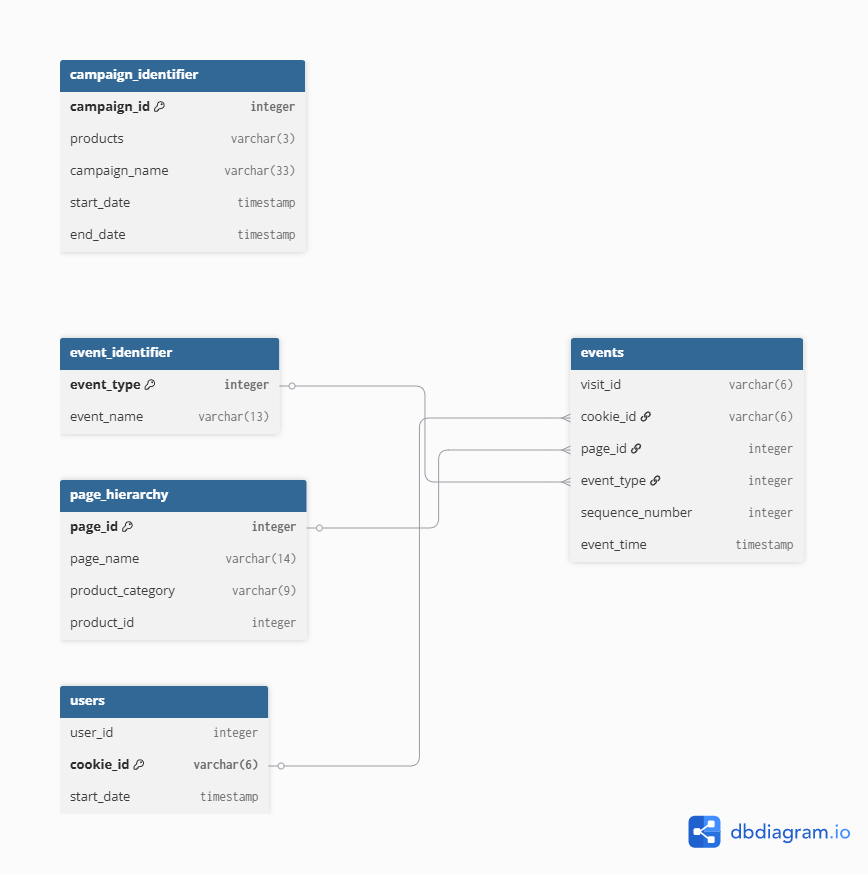
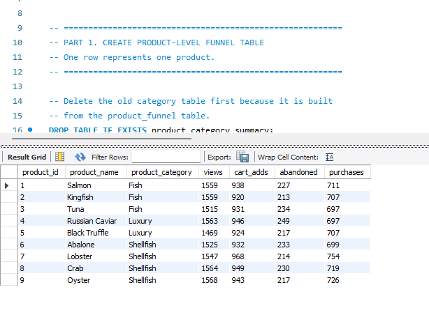
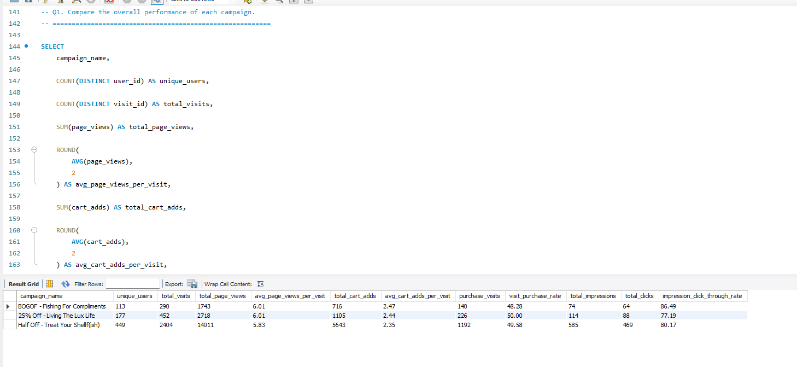
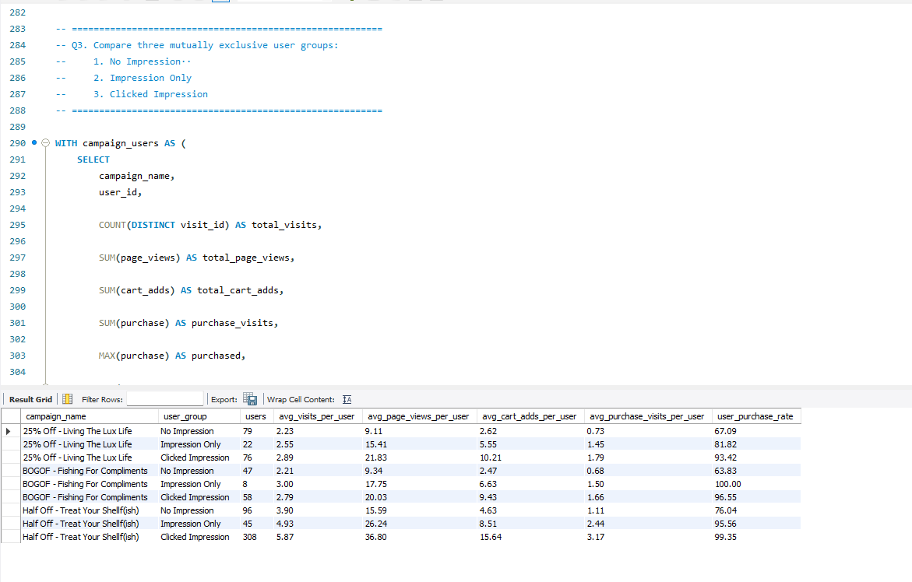

# Clique Bait SQL Analysis

## Project Overview

This project analyzes the Clique Bait online seafood store dataset from the 8 Week SQL Challenge.

Using MySQL, I analyzed website activity, product funnel performance, and digital campaign effectiveness. The project transforms raw event data into business metrics such as page views, cart additions, purchases, conversion rates, impressions, clicks, and campaign uplift.

## Tools Used

- MySQL 8.0
- MySQL Workbench
- dbdiagram.io
- GitHub

Key SQL techniques include joins, Common Table Expressions, window functions, conditional aggregation, `CASE` expressions, date matching, and conversion-rate calculations.

## Database Structure

The dataset contains five original tables:

- `users`
- `events`
- `event_identifier`
- `page_hierarchy`
- `campaign_identifier`

### Entity Relationship Diagram



The `events` table connects to user, event, and page information through `cookie_id`, `event_type`, and `page_id`.

Campaigns are matched to visits using the visit start time because the `events` table does not contain a campaign ID.

## Analysis

### 1. Digital Analysis

The digital analysis examines:

- Unique users and monthly visits
- Events by event type
- Purchase and checkout behavior
- Most-viewed pages
- Product category engagement
- Top products by inferred purchases

The complete queries are available in:

`sql/01_digital_analysis.sql`

Additional query results are stored in:

`key_results/digital_analysis/`

### 2. Product Funnel Analysis

A product-level funnel was created using the following stages:

```text
Product Views
→ Cart Adds
→ Abandoned or Purchased
```

The analysis compares product and category performance, abandonment rates, and conversion rates.



The complete queries are available in:

`sql/02_product_funnel_analysis.sql`

### 3. Campaign Analysis

A visit-level campaign table was created with one row for each `visit_id`.

Campaign performance was evaluated using page views, cart additions, purchases, impressions, clicks, and click-through rates.



Users were also divided into three groups:

- No Impression
- Impression Only
- Clicked Impression

Their browsing, cart, and purchase behavior was compared across campaigns.



The complete queries are available in:

`sql/03_campaign_analysis.sql`

## Assumptions and Limitations

The dataset records purchases at the visit level but does not include order-item details or remove-from-cart events.

A product is therefore treated as purchased when it was added to the cart during a visit that contained a purchase event. Product-level purchases are inferred rather than directly confirmed.

Campaign comparisons are observational. A higher purchase rate among users who clicked an advertisement shows an association but does not prove that the advertisement caused the purchase.

## Repository Structure

```text
clique-bait-sql-analysis/
├── README.md
├── sql/
│   ├── 00_database_setup.sql
│   ├── 01_digital_analysis.sql
│   ├── 02_product_funnel_analysis.sql
│   └── 03_campaign_analysis.sql
├── erd/
│   └── clique_bait_erd.png
└── key_results/
    ├── digital_analysis/
    ├── product_funnel/
    │   └── product_funnel_summary.png
    └── campaign_analysis/
        ├── campaign_performance.png
        └── user_group_comparison.png
```

## How to Run

Run the SQL files in the following order:

1. `sql/00_database_setup.sql`
2. `sql/01_digital_analysis.sql`
3. `sql/02_product_funnel_analysis.sql`
4. `sql/03_campaign_analysis.sql`

The setup script creates the database and imports the original data. The remaining scripts perform the digital, product funnel, and campaign analyses.
